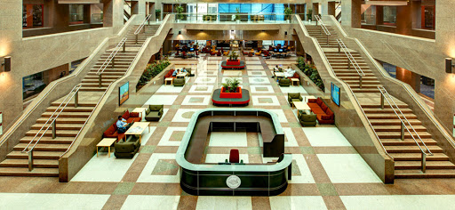
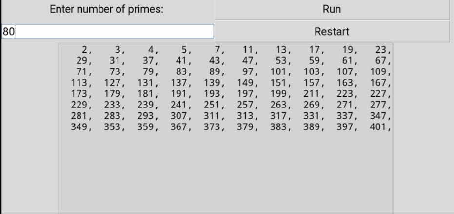
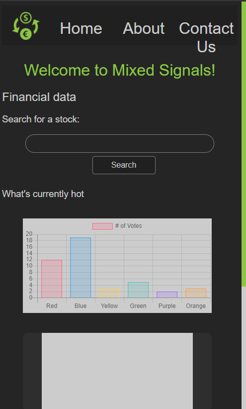

Thanks to Dr. Rayed for giving me the opportunity to share my knowledge with others!
If you missed our talk live, you can watch a recording of it below.

<YouTube id="DgQdyiVt33w" />

While I am definitely not the best at speaking, I decided to get out of my comfort zone, and try my best!
Hopefully this will be the first of many talks I do in FCIT, and I hope to graduate with amazing speaking skills.

# My Motivation for CPCS221

  <h4>
    Before doing CPIT221, I had firsthand experience of the benifits of
    communication
  </h4>

It all started in my foundation year in King Abdulaziz University, where I had set myself one goal - <b>to learn how to program</b>.

As with the majority of students currently in King Abdulaziz University, I had my first real experience with programming [through CPIT110](https://csu.kau.edu.sa/Pages-CPIT110.aspx).
I was incredibly lucky, since this was the first year that the course had transitioned from teaching Microsoft Office, into teaching Python.
As with all skills, I was incredibly bad at first.
There was always a looming feeling of being stuck, and I was uncertain on what I should be doing next.
I decided that I would stay in the library for a couple hours every day after university, to be

  </img>

However, I started reading books, and talking to other people in the programming community, and that is when I started seeing growth.

My first 'Aha' moment was when I realized you could redirect python's `print` into a `.txt` file.
I then thought to myself, what would happen if I made an infinite loop?
Me and the students beside me were watching the file size, as kilobytes turned into megabytes, and megabytes turned into gigabytes.

To me, writing code was like figuring out some mysterious puzzle, with an unknown prize in the end.

Later on, we had a presentation to make in COMM101, and of course, I did it on python.
Overall, I didn't do too good of a job at presenting, as verbal communication was my weak point.
I had a horrible stutter, and little to no body language.
Therefore, when I made my first video for CPIT221, I took 100 attempts to record it!
Oddly enough, I had gone from too little body language, to too much!

<YouTube id="uor4oVz-WJc" />

However, I had a trick up my sleeve.
I had figured out how to run python on my phone, and wrote a simple GUI program.

  </img>

At the time, I was surrounding myself with others who had the same goal as me,
and I was learning extremely fast.
I had heard a lot about Harvard's CS50, and decided to take it.
I eventually made a video on Harvard's CS50 in my Make Me Buy video!

<YouTube id="zigvhb_FRtU" />

  </img>

I had started doing open source projects with others,

  </img>

I eventually reached the stage where I was even leading some open source projects,
and the lessons I've learnt from that experience were critical to my proposal.

Effectively communicating with my community was what lead me into obtaining the skills I know today.

# Within CPIT221

Even though CPIT221 is worth only 2 credit hours, I have learnt more from CPIT221 alone than all other courses combined.
I talked to people who did CPIT221 before they changed the course only two terms ago, and it was completely different.

Without a doubt, the more effort you put into CPIT221, the more benifit you get out of it.

For me - as a university student, my goal is to learn as much as I can, to equip myself with the skills I need in the future.
Therefore, I don't limit myself to what you're learning in university.
To maximize what I learn, I always go beyond in all my courses.

And my work has definitely payed off, as I've learnt more in CPIT221 than any other course In KAU so far, even Including programming.
Now you might be wondering, wait, what did CPIT221 have to do with programming?

## Programming

One of my goals for the course was to show people how amazing programming is, and meeting others who I can exchange my knowledge and grow with.
If you look through my twitter - which I created in CPIT221 - a lot of the projects I do are related to the courses I'm currently taking.
As a way to train myself into coming up with ideas and keep my programming skills sharp, every week or two I come up with and create a new project.
Otherwise, I attempt to learn something new, either on my own, or by taking an online course.

Of those projects, last term I had learnt C++ and assembly to apply the things I learnt in CPIT201, and so on.

However, the course which I've spent the most on was CPIT221.
I saw Dr. Rayed and Dr. Buhari were passionate about their course, which lit a fire in me as well!

In the very beginning, I had just sent Dr. Rayed a picture of a project I had been working on,
which made a word cloud of the most common words people had mentioned in their blog.
My code then inspired Dr. Buhari to make the grammar corrector you see today, [and the rest is history](https://cpit221.ryansamman.com/).

## Meeting New People

<Quote name="Jim Rohn">
  You are the average of the five people you spend the most time with
</Quote>

After the first task of CPIT221, I had met [Khaled AlAsmari](https://khaledalasmari.com/), who is likely the second best programmer in FCIT20.
However, the first time we got together to do something was the proposal task of CPIT221.
What impressed me the most about Khaled is that he had stayed up all night to help finish the proposal.
Ever since, we've studied and done several projects together, as well as perfecting our teamwork together.

As well as Khaled, [I have met many other students who are really great at what they do.](https://cpit221.ryansamman.com/values)

Odds are that you are using the drive that my group has created.

As well as this year's students, I had met a couple people from the upper years.
One of those people were Anwar, who I really look up to.
One day, I asked Anwar if he was interested in joining a competition with me and Khaled.
While I hadn't expected to, our team went extrodinarily far.
Many teams had way better people, all of which are third and fourth year CS students.
The only possible way we could have beat them, was through extremely good teamwork, which I'll go into detail in a bit.

<Tweet id="1373331035539267587" />

I had also been talking to a student who is currently taking CPIT221, and convinced him to join Bandar and Omar's team.

# Teamwork

  <h3>What is the most important part of the proposal?</h3>

Without a doubt, your team. It isn't only limited to the proposal! It may be a business, or an app, or any kind of project.
No matter how amazing your idea is, if you don't have an effective team, there is no way that you could get anything productive done.

When you're doing something alone, the formula is simple - the result is proportional to your skill and effort.

However, when you're acting as a group, the formula is different.
9 pregnant women can't make a baby in 1 month!

Now if you want a practical example of good "teamwork", look at cloud services
You wouldn't believe how much of the internet is run off of one cloud service provider - Amazon Web Services.
Over 30% of the internet is hosted by that one cloud service provider!
If you take a closer look at how cloud services work, you won't see one server acting alone.
No matter how good that one server is, it can't handle everything on it's own.
And what happens when that one server goes down? There must be a better way.
Instead, these providers use many smaller servers.
Each one on it's own may not be that impressive.
But if several go down, everything still works fine.
These servers are working together very efficiently, and overall, they create something extrodinary.

Before even beginning a project you need to think carefully about your team. Your team could make or break a project.

For me, my teammates weren't just temporary people for me to finish the task.
I had been meeting and talking to people across the entire term through twitter and WhatsApp,
and when the group task came, I already had a good idea on who I would be working with.

For me, while I knew a few people from my foundation year,
I had decided that I wanted to make the proposal with people that I had met in CPIT221.

Just a few days ago, I had done a programming competition with Khaled and Anwar.
Even though we were weaker than many teams, we still reached an extremely high rank.
This was not due to me being really good at Computer Science, it's all about teamwork!

The same concept applies to the proposal. With a good team, even if you yourself are not amazing at a certain topic,
when everyone comes together and plays their strength, amazing things can happen.

Those same people are who you will likely spend the most time with in the coming years of university.
If you can't get together a good team, you aren't going to enjoy university that much.
Networking and expressing your skills with others is very important, and it will pay off long after university.

# Proposal Inspiration

For our term, our proposal was on improving a course we were currently taking.
Your task may be different, but the idea is the same.
The best way to choose your topic is to choose something which you have close to heart, or had past experience on.
That way, your ideas you come up with will be ones which you believe are best.

For me, that was programming.

The main advantage FCIT has over any other major is that programming is that you will be exposed to programming throughout the majority of the courses taken.
If you are a good programmer, you can create anything you set your mind to, be it a website, an app, or a game.
This freedom to create is why I decided to enter Computer Science over any other major, including medicine.

I've done a significant amount of courses related to Programming and Computer Science.
Naturally, I decided that I would be doing my proposal on CPCS202.

From a bird's eye view, CPCS202 seems to be good.
The course objectives cover the essentials of programming, and the scope is very small.
Even though the course objectives are all perfectly fine, a large portion of the students are just barely passing.
These foundational concepts carry over to every other course, so if a student hasn't mastered all these objectives, they would have a hard time dealing with the coming courses.

If you ask any programmer, "does your code work"? the majority of them wouldn't be confident that it does.
However, while doing programming courses on my own, the majority cover some kind of automated testing of the code.
Therefore, I wanted to

While I did my proposal on CPCS202, if I were forced to choose another course, [I would have chosen STAT210](https://cpit221.ryansamman.com/proposal/chosen).

# Proposal Phases

Now, this advice won't only apply to the proposal, but to all projects in general.
As with all projects, the goal and scope needs to be well defined.
While real-world projects need a bit of thinking beforehand, with the proposal, mostly everything is clear.

However, hopefully the proposal will be just an introduction to things you will be doing in the future, where everything wouldn't be so clear cut.
Non-technical people don't understand the fine details that well, and it will likely be up to you to recognize there are some things missing.
Personally, I've done a few open source projects where we didn't focus on the main goal, then everything ballooned out of control and then the project died.

## Planning

Immediately after the task was announced, me and my teammates created a group, and started bouncing ideas off eachother.
As I had mentioned, the teammates you have are extremely important, and even if you haven't gotten an idea yet, just keep talking and you'll eventually come up with something.
Eventually, we had a lot of ideas, even too many! We all got incredibly lost with how much we came up with.

However, in my experience with open source projects, I decided to add everything onto trello.
Not only did we group our ideas on trello, but we had put together all the resources we would need.
From contact information, to presentation templates, to samples of proposals and presentations, everything was neatly organized.

Not only do I use trello for projects, but I also use it to organize my day to day tasks and ideas.

To work together in real-time, we had used Discord to communicate verbally, and share our screens.

## Information gathering

### Survey

To gauge the opinion of the students on my proposal, I created a survey covering our main points.
Personally, we did the survey a bit too early, and we wanted to ask a few more questions later down the line.

While my teammates were working on the proposal, I was trying to code up a program that cleaned up the data, and visualized it.
In one of those weeks where I decided to learn something new, I decided to learn Pandas, which I used here.

### Talking to professors

Looking back, I would have talked more to the professors, to get their opinions on my proposal.

## Implementation

## Presentation

## Issues

Everything is a continuous process, including my proposal. As such, there will always be some improvements which you only realize after the project is over.

On my side, I wish that I had had a better microphone. The audio quality in my presentation wasn't too great,
which is why I bought the headphones Faisel presented in his 'Make Me Buy' video.

Removing the indentation in the beginning of the paragraph.
It is for an old style of writing when newspapers had crammed paragraphs together.

More References. If I were the recipient of a proposal, I would like to have a lot more science backing the proposal.
