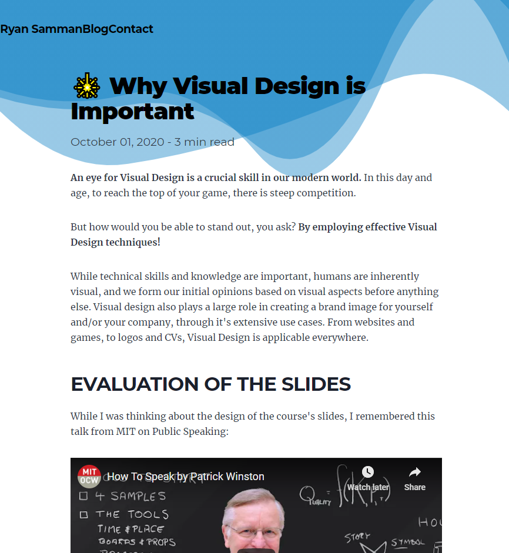

Having finished my first real website [on my experience with CPIT221](https://cpit221.ryansamman.com), I learnt a lot about Frontend Development. While I had been learning the fundamentals for several months, I never created something that brought everything together. Including content, design, and interactivity, the project pushed me well into unknown territory.

<iframe name="CPIT221 Experience" className="border-blue-600 rounded" style={{width: "100%", height: "70vh"}} loading="lazy" src="https://cpit221.ryansamman.com"></iframe>

----

<br />

While I usually plan out a project in advance, I decided to take a more heads-on approach with my website on CPIT221. There was simply too much I didn't know, and any hard plan would just be an unneccessary constraint on what I could have created. By the end of the project I was able to get a better grasp of Frontend Development, [figure out what I should be doing, and what I should be avoiding.](https://github.com/RyanSamman/CPIT221)

My main goal for my first website was to build together the skills I needed to create my own blog, which you are currently reading! I read and watch a lot about a wide variety of topics, and I normally chat to a few close friends on what I have in mind. Therefore, I realized that I could put my writing to better use if I share it with others. 

The biggest mistake I did in my first website was not making an initial design or mock-up before starting. While did I attempt to redesign the website several times, I had no clear design concept to follow, and it ended up looking odd. Equipped with my better understanding on how I would be doing things, I made a quick mockup on how I envisioned my website.

<Tweet id="1336270942230736896" />

I did not want to repeat the old website's stale design, so I decided to create a design on Adobe XD. 

My friend is a fulltime dev, and uses figma and adobe xd to get a good idea on how everything would look beforehand.

By just following a good color scheme, I managed to put together a good design, which gave me a good idea on how I wanted to proceed. While implementing the design, I made some other good designs, which I might try out in the future.



<br />

With the design down, I tackled my second major problem when I created my first website.

which  However,Facing many hurdles on the way, 

While my previous website was created with Create React App, I decided to go with Gatsby this time around. Next.js is a better option long-term, as it has better flexibility, allowing you to create Static Pages, Dynamic Pages, and Server-Side Rendered pages. However, that flexibility also has a larger difficulty curve.

Further

In the beginning, I was suprised to see that nearly everything I had implemented manually was already there in Gatsby's Boilerplate. 

I don't like traditional websites, they are boring. That is why I decided to use React, as I wanted to create something interactive, not just display a bunch of text on a page and call it a day.

## Components

Embedding a Component

A large problem I had in my first website was that I wasn't able to use React Components within Markdown. However, I found out that with MDX, this is possible.

Components are very important, as it allows me to reuse and code easily, and is far easier to work with.

<Quote name="Ace Chad" title="TestCo Employee" social={{website: "https://ryansamman.com"}}>
    Lorem ipsum dolor sit amet, consectetur adipiscing elit. Mauris at magna ut lacus pellentesque porttitor. Nam molestie rutrum mollis. Nam eget turpis vel velit pulvinar venenatis. Integer pretium turpis ac mauris vulputate elementum. Duis imperdiet sollicitudin velit, quis porta nisi scelerisque quis. Vestibulum feugiat nunc quis fringilla bibendum. Sed malesuada gravida arcu molestie ullamcorper. Etiam elementum aliquam sem, ut laoreet dui aliquam eu.
</Quote>

## Tweets

Can Embed Tweets

<Tweet id="1343612171155107841" height={1200} />

## Youtube videos

<YouTube id="zlm1aajH6gY" />

## KaTeX

Mathematical Equations such as <InlineMath>\int_{\infty}^{-\infty} x^2 dx</InlineMath> can be placed inline with the text.
Alternatively, it can be used as a block such as below.

<Math 
    className="text-2xl"
    math="\begin{aligned} y & = x^2 + 2x + 1 \\ & = (x+1)(x+1) \\ & = (x+1)^2 \end{aligned}">
</Math>

-------

<Math 
    className="text-2xl"
    math="-2 \left|x - \left( \frac{n-1}{2} \right) \right| + n">
</Math>


## Code

Inline Code `testing`


```js
// JavaScript
function diamond(n) {
	if (n < 0 || n % 2 == 0) return ""
    const midpoint = (n - 1) / 2
    const spaces = x => Math.abs(x - midpoint)
    const filled = x => n - 2 * Math.abs(x-midpoint)
    const layer = l => " ".repeat(spaces(l)) + "*".repeat(filled(l)) + "\n"
	return [ ...Array(n).keys()].reduce((d, l) => d + layer(l), "")
}

print(diamond(11))
```

```py
# Python
def diamond(n):
	if n < 0 or n % 2 == 0:
		return ""
	midpoint = (n - 1) // 2
	spaces = lambda x: abs(x - midpoint)
	filled = lambda x: n - 2 * abs(x-midpoint)
	layer = lambda l: " " * spaces(l) + "*" * filled(l) + "\n"
	return "".join([layer(l) for l in range(n)])


print(diamond(11))
```

```haskell
-- Haskell
diamond :: Int -> [Char]
diamond n 
    -- Return Nothing if even
    | n `mod` 2 == 0 = ""
    | otherwise = unlines $ [layer n x | x <- [0..(n - 1)]]
    where
        midpoint :: Int -> Int
        midpoint n = (n - 1) `quot` 2 

        spaces :: Int -> Int -> Int
        spaces n x = abs (x - midpoint n)

        filled :: Int -> Int -> Int
        filled n x = n - 2 * abs(x - midpoint n)

        layer :: Int -> Int -> [Char]
        layer n x = (concat (replicate (spaces n x) " ")) ++ (concat (replicate (filled n x) "*"))

main = putStr(diamond 11)
```

## Gists

<Gist id="18c68c2fd3e7e40d09d0c40f84208e6f"/>

## RSS Feed

I used Gatsby to create an [RSS Feed](/rss.xml), containing a standardized format of my blog. 
This can be easily parsed and used in applications, and I have a project planned using it in the future.

Alas, while Frontend Development was a fun experience, my nature is as a problem-solver, not a designer. While I hope to inspire others into what you can be doing with 

The world is slowly becoming more reliant on websites. For a day-to-day person, people rarely install programs from the internet, and are starting to rely on just a few apps. While I had made many projects in Python, the chances of anyone downloading and using my programs are slim.

That is why I realized early on when I started programming that I needed to become competent to some degree on frontend technology. While people wouldn't go out of their way to download a program, opening a link and being able to interact with my code is trivial.

While I don't intend to master anything related to frontend development, I do like solving problems, and I'm sure that I would be facing a frotnend in the future.
